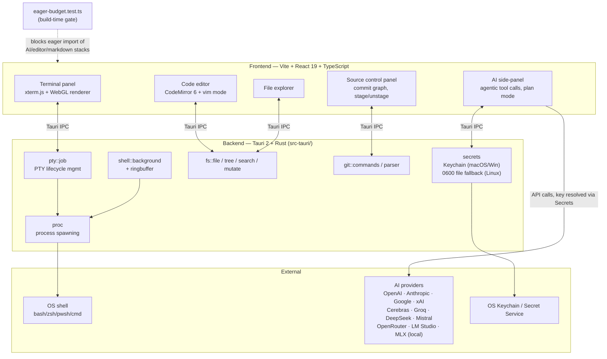
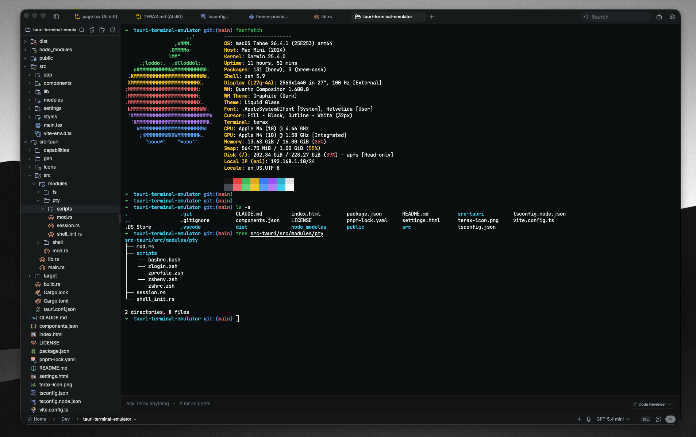
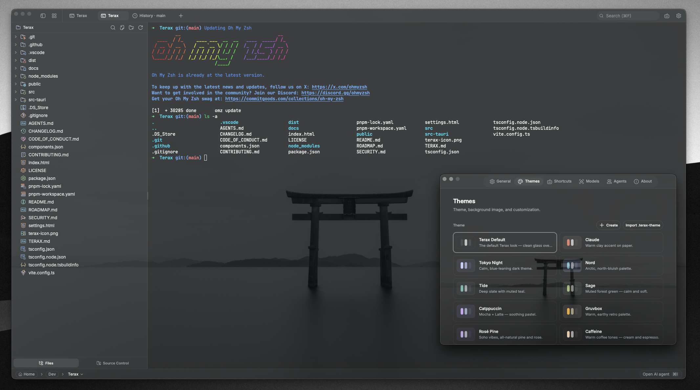
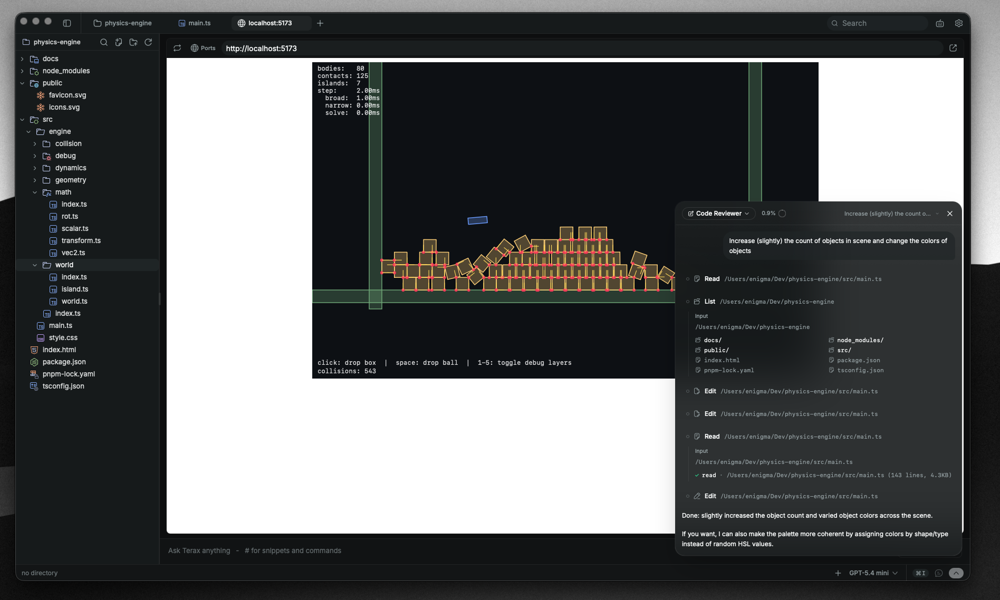
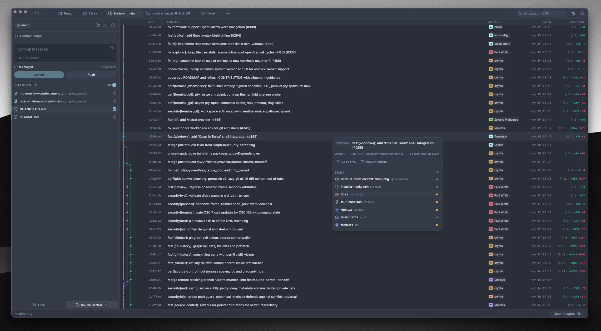
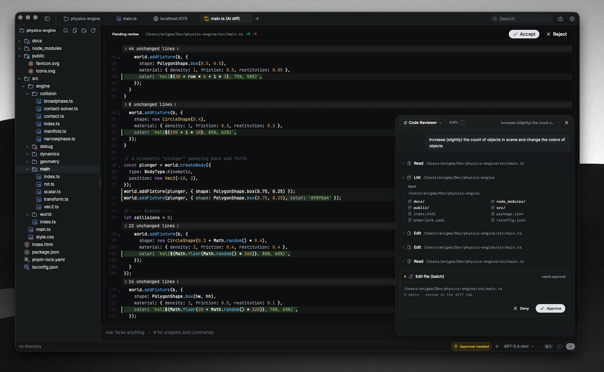

<div align="center">
  
  <h1>Jonathan</h1>

  <p><strong>A terminal-first, agentic dev workspace built on Tauri + Rust + React.</strong></p>

  <p>
    
    
  </p>
</div>

---

Personal project. A native PTY-backed terminal with a code editor, git source control, file explorer, and an agentic AI side-panel — built from scratch (Tauri 2 + Rust backend, Vite + React 19 frontend), not a fork.

## What it does that most terminal apps don't

- **A CI-enforced startup-bundle budget, not a one-time Lighthouse screenshot.** `eager-budget.test.ts` statically traces the import graph of every window entry point and fails the build if a heavy dependency (`@ai-sdk`, `streamdown`, `@codemirror`, `@uiw`) ever gets pulled into the eager/startup bundle. Most apps measure bundle size after the fact and hope it doesn't regress; this one makes a regression a failing test.
- **A secrets backend that's honest about platform differences instead of assuming one keyring model everywhere.** macOS and Windows use the native OS keychain via the `keyring` crate. Linux is handled separately and deliberately: the default Secret Service (D-Bus) backend silently fails on systems without `gnome-keyring`/`kwallet` running — a common case for an AppImage/deb/rpm desktop app — so Linux falls back to a `0600`-permission file in the app's local data dir, written atomically (write-to-temp, then rename). Same approach Chromium/Brave use in the same situation, documented in-code with the reasoning, not just implemented silently.

## Architecture



## Screenshots

<table>
  <tr>
    <td align="center"><br/><sub>Multi-tab terminal with WebGL rendering</sub></td>
    <td align="center"><br/><sub>Custom themes, presets, and background images</sub></td>
  </tr>
  <tr>
    <td align="center"><br/><sub>Web preview of local dev servers</sub></td>
    <td align="center"><br/><sub>Source control panel with git graph in history</sub></td>
  </tr>
  <tr>
    <td colspan="2" align="center"><br/><sub>Agentic AI workflow with edit diffs in the code editor</sub></td>
  </tr>
</table>

## Features

### Terminal
- xterm.js with WebGL renderer, multi-tab with background streaming
- Native PTY backend (Rust, `src-tauri/src/modules/pty/`)
- Split panels (horizontal and vertical)

### Code editor
- CodeMirror 6 — TS/JS, Rust, Python, Go, C/C++, Java, HTML/CSS, JSON, Markdown, and more
- Vim mode (`src/modules/editor/lib/vim.ts`)
- Multiple built-in themes, including Gruvbox, Nord, and Tokyo Night

### Source control
- Stage / unstage hunks, commit, push
- Git history pane with a real commit graph (Rust-side parsing in `src-tauri/src/modules/git/`)

### File explorer
- Fuzzy search, keyboard navigation, inline rename
- Attach files and selections directly to the AI side-panel

### Web preview
- Auto-detects local dev servers from terminal output and opens them in a preview tab

### AI
- **BYOK providers:** OpenAI, Anthropic, Google (Gemini), xAI, Cerebras, Groq, DeepSeek, Mistral, OpenRouter, or any OpenAI-compatible endpoint
- **Local:** LM Studio, MLX
- Agentic workflow: plans, tool calls (file read/write/edit/grep/glob, shell with approval gating, background processes)
- Keys are written to the OS keychain via `keyring` (macOS/Windows) or a `0600` local file (Linux) — see Architecture above

## Build from source

**Prerequisites**
- Rust (stable), https://rustup.rs
- Node 20+ and [pnpm](https://pnpm.io)
- Tauri prerequisites for your platform, https://tauri.app/start/prerequisites/

**Run**
```bash
pnpm install
pnpm tauri dev          # development
pnpm tauri build        # production bundle
```

**Checks**
```bash
pnpm exec tsc --noEmit                                            # frontend type-check
cd src-tauri && cargo clippy --all-targets --locked -D warnings   # Rust lint (matches CI)
cd src-tauri && cargo test --locked                               # Rust tests
```

## Tech stack

Tauri 2, Rust, `portable-pty`, React 19, TypeScript, Vite, xterm.js, CodeMirror 6, Vercel AI SDK v6, Tailwind v4, shadcn/ui, Zustand.

## License

Apache-2.0 — see [LICENSE](LICENSE).
